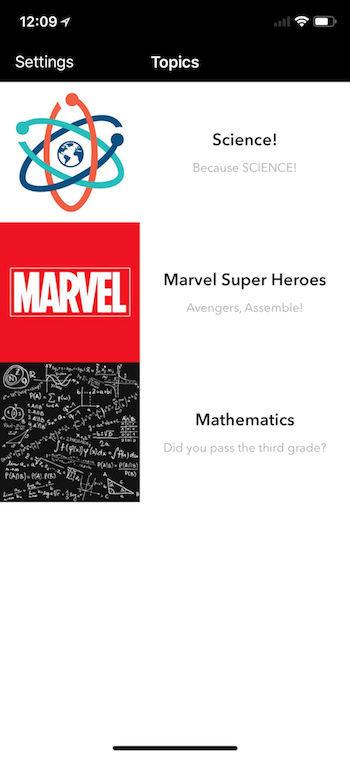

# iQuiz - Test Your Knowledge App

This mobile application tests how well you think you know things like math, science, and even movies. It is part of an assignment given by the Informatics' *Mobile Application Development* class.

## Functionalities

- Keep track of scores
- Offline gameplay
- Numerous categories to choose from

## Screenshot

